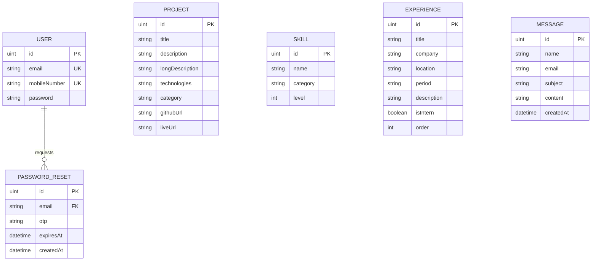

# 🚀 Developer Portfolio & Admin CMS Engine

[](https://go.dev/)
[](https://nextjs.org/)
[-blue?style=flat-square&logo=sqlite&logoColor=white)](https://gorm.io/)
[](#-production-deployment-architecture)

A state-of-the-art developer portfolio website integrated with a secure, responsive Administrative Content Management System (CMS) dashboard. This unified full-stack monorepo is architected with a layered **Go backend engine** and a high-performance **Next.js app router frontend**.

---

## 📂 Codebase Monorepo Architecture

This repository is organized as a unified full-stack monorepo:

```
DnyaneshPortFolio/
├── backend/            # Go REST API (GORM, SQLite, JWT, SMTP OTP)
│   ├── config/         # Database and Logging Initialization
│   ├── controllers/    # API Controllers (Panic Recovery, Body Decoding)
│   ├── dtos/           # Input Data Transfer Objects (Validation Specs)
│   ├── middleware/     # Auth & CORS Security Interceptors
│   ├── models/         # GORM Schemas (Entity Definitions)
│   ├── repositories/   # Database GORM Operations
│   ├── services/       # Core Business Logic Services
│   └── main.go         # Application Router Bootstrap
│
├── frontend/           # Next.js App Router (Showcase, Admin Dashboard)
│   ├── public/         # Static Assets & PDF Resume
│   └── src/app/
│       ├── about/      # Skill Ratings & Work History Timeline
│       ├── contact/    # Inquiry Submission Interface
│       ├── dashboard/  # Secure Five-Tab CMS Panel
│       ├── login/      # Admin Login & OTP Forgot Password Flow
│       └── projects/   # Category Filter & Showcase Grid
│
├── DEPLOY.md           # Production Deployment Guide (Vercel & Render)
└── README.md           # Full-Stack Monorepo Architectural Overview
```

---

## ⚡ Core Feature Highlights

### 🎨 Frontend Web App (Next.js)
* **Glassmorphic UI Design**: Sleek dark and off-white gradients, custom responsive layout grids, and interactive micro-animations.
* **Unified Admin Control Center**: Five-tab dashboard panel to inspect visitor inquiries, manage projects/skills/experiences, register co-admins, and upload your PDF resume.
* **Co-Admin Role Management**: Create and authorize secondary administrator accounts directly from your settings panel.
* **Forgot Password OTP Flow**: Password reset wizard using verification one-time password (OTP) codes on your login screen.
* **Secure Client Guards**: Hydration security interceptors and JWT validation logic redirecting users to the login screen on unauthorized query triggers.

### ⚙️ Backend REST API (Go)
* **Layered Clean Architecture**: Structured repository-service-controller flow isolating database access, business rules, and API endpoints.
* **Strict Controller Standards**: Conformity to panic recovery handlers, manual request body decoders, parameter validation, and unified response wrappers.
* **Cryptographic Credentials**: Salted SHA-256 equivalent password encryption using Bcrypt.
* **Database-Persistent Resume**: Serves raw PDF binary streams directly from PostgreSQL, supporting instant, dynamic updates via dashboard uploads.
* **OTP Verification Engine**: Cryptographically random 6-digit verification code generator with automated 10-minute expiration policies.
* **Flexible Dispatch Logger**: Automatic email dispatch via SMTP server variables with fallback server logging for free tier testing.

---

## 📊 Database Schema Relationships

GORM automatically migrates the following database schemas:



---

## 🚀 Quick Launch Guide (Local Development)

### 1. Run the Go Backend
Navigate to the `backend/` directory, resolve modules, and start the runtime server:
```bash
cd backend
go mod tidy
go run main.go
```
*The REST API compiles and listens locally on **`http://localhost:8081`**.*

### 2. Run the Next.js Frontend
Navigate to the `frontend/` directory, install packages, and start the development bundler:
```bash
cd frontend
npm install
npm run dev
```
*The Next.js framework starts compiling and runs on **`http://localhost:3000`**.*

---

## 🌐 Production Deployment Architecture

```
                       ┌────────────────────────────────┐
                       │       Go Backend (Render)      │
                       │   https://your-api.render.com  │
                       └───────────────┬────────────────┘
                                       │
                               HTTPS Requests (TLS)
                                       │
                                       ▼
 ┌──────────────────────┐    Next.js Client Fetch   ┌──────────────────────┐
 │    Public Portfolio  ├──────────────────────────►│   Admin CMS Control  │
 │  (Next.js on Vercel) │                           │  (Next.js on Vercel) │
 └──────────────────────┘                           └──────────────────────┘
```

For step-by-step instructions on deploying the full stack onto cloud platforms (Render + Vercel), setting up environment variables, and configuring custom domain DNS mappings (GoDaddy), please check out the **[Production Deployment Guide (DEPLOY.md)](file:///Users/dnyaneshwarkokate/Dnyaneshwar_Personal/DnyaneshPortFolio/DEPLOY.md)**.
